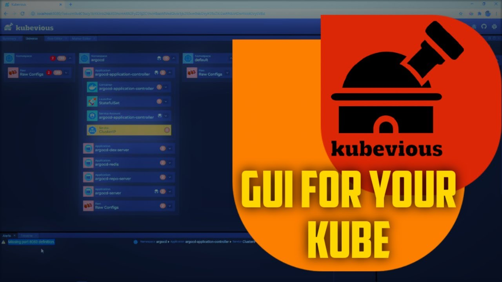

Complexity in managing containers brings us the need for an Orchestrator. One well-known production grade container Orchestrator is Kubernetes. Soon after playing with all the YAML manifests to define and refine your clusters, you realize a need for an easy use Graphical User Interface or GUI to get a glance through your cluster. 
Both operations and developer teams needs an easy way to look through the complex setup that has been put in place. 
The first option everyone see is Kubernetes Dashboard that ships with Kubernetes, soon after setting up and using it we realize its complex to secure and difficult to expose it to all users in our organization. If you have succeeded using Kubernetes Default Dashboard, comment below, I would like to know how you made that work for you. But most of us start looking for alternatives.
Imagine a GUI over kubernetes that can easily shows all your resources in an appealing interface and not only that it also warns you if you are missing some best practices. Sounds interesting? Welcome to Kubevious - the obvious GUI for Kubernetes.

Before we jump, we already discussed multiple GUIs in our channel
1. [K9S](https://www.youtube.com/watch?v=1EaVrpMvLH0) - VIM like interface with lots of shortcuts to scroll through your cluster.
2. [Kubernetes Lens IDE](https://www.youtube.com/watch?v=namZg1UC7wc) - A desktop application that can connect to clusters remotely and manage your resources.
3. Octane - Another IDE for kubernetes we used in some of our videos.


For full video on this article click below
[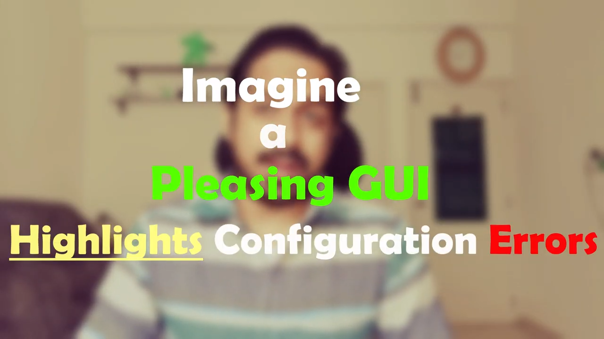](https://www.youtube.com/watch?v=E3giPRiXSVI)

What is your favourite IDE or GUI or Dashboard when it comes to Kubernetes, Comment that below and lets interact.

Today we are going to see about Kubevious, this IDE, takes not so obvious approach, with features like analysing your kubernetes cluster like
- Text Based Searching
- Hierarchy based configuration access to your full cluster resources
- Impact radius analysis
- Time-Machine - That word itself is so cool.
- Configuration validations
- Capacity planning and list goes on.

 Stay till the end of this article, I am going to explain starting from setup and going to end it with where it can help you in your day to day activities, and dont forget to share this with your friends and colleages.


### Installation
The easiest way to install kubevious is using helm and just follow below 3 steps:

```
kubectl create namespace kubevious
helm repo add kubevious https://helm.kubevious.io
helm upgrade --atomic -i kubevious kubevious/kubevious -n kubevious
```

Now that kubevious is running your cluster
Quick way to access is to use kubectl port-forward to expose it. You can also create kubernetes ingress if you will like to.

```
kubectl get pods -n kubevious -l "app.kubernetes.io/component=kubevious-ui" -o jsonpath="{.items[0].metadata.name}
kubectl port-forward <<<pod name from above>> 8080:80 -n kubevious  
```

Just for demonstration I am going to deploy argocd, which is kubernetes native CI/CD tool that runs within kubernetes cluster, with lots of related components, I think it can help us understand kubevious features better. Pls note I could have taken any application that runs in kubernetes for this example.

So let me quickly install argo cd

```
kubectl create namespace argocd
kubectl apply -n argocd -f https://raw.githubusercontent.com/argoproj/argo-cd/stable/manifests/install.yaml
```

Now that argocd is installed, lets open our kubervious IDE to check it.

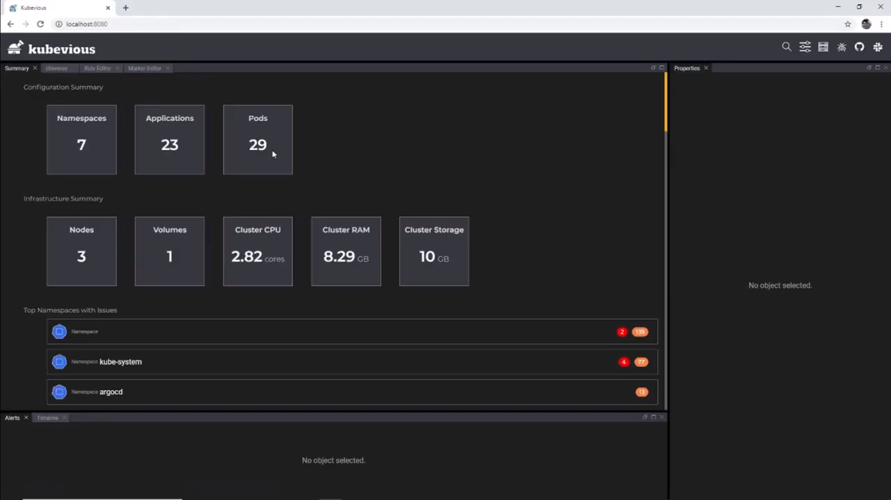

### Search your cluster like never before
Very first amazing feature you will notice, is this text based feature. You can basically search with any text and it will list all the resource from the cluster that matches your text in some way.
Lets say i want to looks for resources using port 8080 and then I can filter the resource that I am interested in, say for example I am selecting service. 
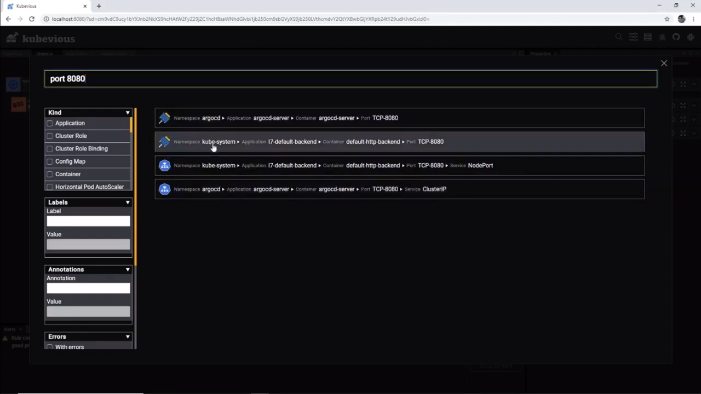
Now you can see it shows two resources one from ArgoCD and other from kube-system.

You can further use other filters like labels, annotations, just resources with errors or warnings and kubevious specific markers like high-memory-user etc. I will explain about in a while in this article.
Have you ever seen such text based full search in any other IDE or GUI for kubernetes? If so comment below.

### Hierarchy Based Configuration Access
I know I jumped into search first. But the most beautiful thing that Kubevious does is it scans the cluster and provides this easy to access view.
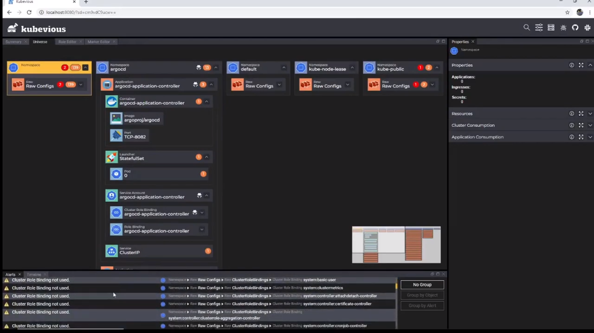
Look at this summary view it shows configuration summary listing count of your namespaces, applications and pods. No you cant click it, its just for information.
And then Infrastructure Summary listing nodes in your cluster, volumes used, overall Cluster CPU, memory and storage. Cost information here if available would have helped recent trend in finOps. If you dont know what is FinOps, we are going to comeup with a detailed discussion on finops in our channel, make sure you hit that subscribe button and bell icon.
Coming back, if you scroll down it immediately lists the top namespaces with issues, Kubevious identifies many configuration errors, such as misuse of labels, missing ports, and others. I will show you some examples shortly.

### Impact Radius Analysis
As we know in Kubernetes you can share and reuse configuration. Imagine this scenario, wait you dont have to imagine, it happens all the time. We try to change a config without knowing all the places it is being referred. Thanks to Kubevious, it can show you all the impacted components based on the config you choose. I am navigating to dnsmasq config file, we can see this small "Sharing" marker next to the configmap. and I can see in the properties window that it is also shared by kube-dns.

This way you know modifying this config will also impact kube-dns.

### Time Machine is here
Enough watching in movies, lets see time machine in action now. Yeah kubevious do help you go back in time and look at your cluster configuration at that point of time. This helps in identify how cluster configuration changed over time and that might have resulted in any issue you are facing in your cluster.
Lets take an example.
Let me navigate to argocd-application-controller and select this service. hmm I see targetPort is mentioned as 8082. Lets edit and make it as 8083. 
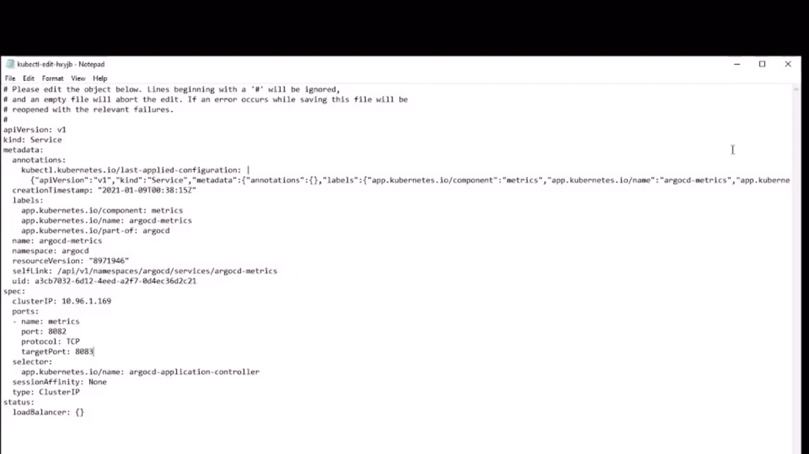
Heading back on kubevious we can immediately see, it has the updated config and also it shows a warning "Missing port 8083 definition.". Which is correct, we gave an invalid port where there is no container listening. So you when you make a configuration mistakes Kubevious highlights it immediately. 
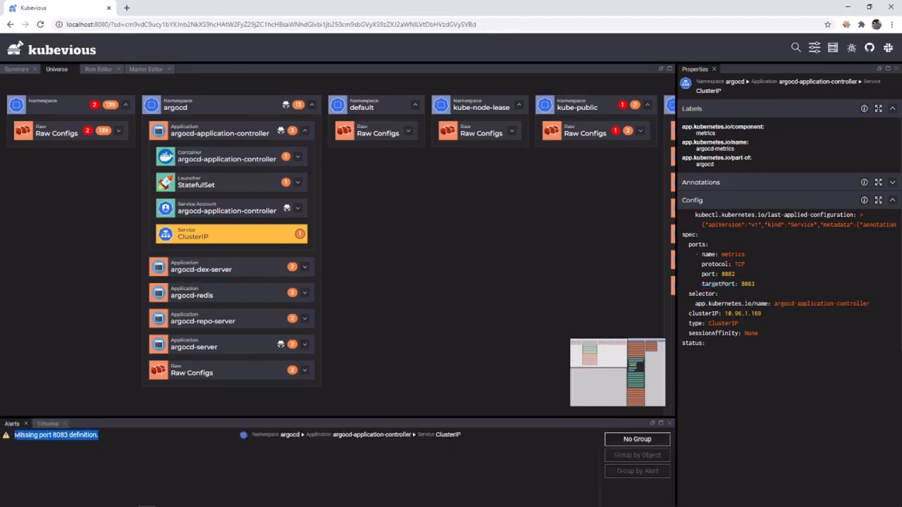
It is not just that, the main functionality is here in this timeline tab. You will have to activate timemachine by clicking here. 

Now you have the ability to go back in time and see what config was present at that time. By going back in the timeline you can see port was 8082 before I chnaged it and there is no warning at that time. So I can take action rightaway to fix my changes. 

### Configuration validations with custom rules support
I just showed you one validation Kubevious did for us when we gave a wrong port number in our service configuration. But thats just one check, Kubevious comes with some additional checks out of the box. Each of those configuration validations will give warnings in respective resources. Lets find some critical validation errors, in Kube-System we can notice 4 critical errors and lots of warnings displayed. If I drilldown, I can see its under rawconfigs and lets check this Cluster Role Binding. Kubevious identifies that for this cluster-role-binding there is no linked service account. Cool right.
While navigating you would have noticed that there are other markers here. Lets quickly understand them - 
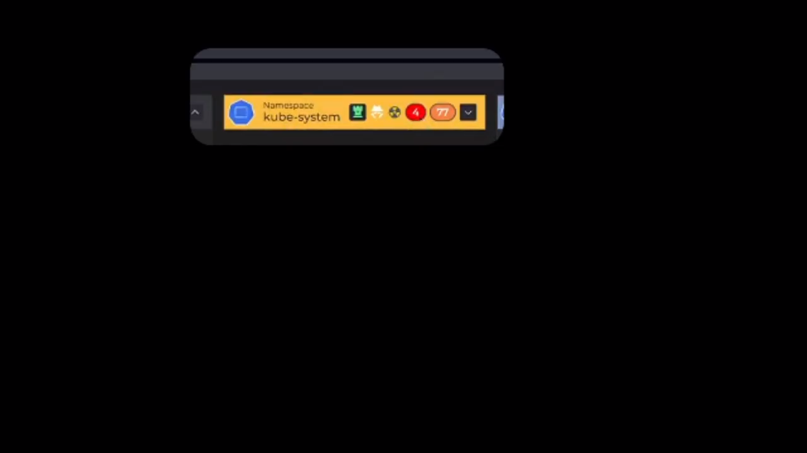
The Rook Icon, represents that this is a large namespace
The Spy Icon, resprents that this resource has got over kubernetes API access outside its namespace
The Radio active icon represents there are resources in this namespace with excess privileges or say host network enabled etc
Critical eror icon, notifies that there are critical errors like missing service account like we saw in our previous section
The warnings Icon, It useful to see quick warnings in your cluster.
And the list goes on.
I know its already lots of information, lets take a deep breath. Over and above this you can also write custom rules to keep your organization validations in place. Example. I want to ensure my image always be version v1. 
Click on the rule editor and use the below

```
# Target
select('Image')
```


```
# Rule Script

if (item.props.tag != 'v1') {
    error("You are not using v1. Please don't do that.");
}

```

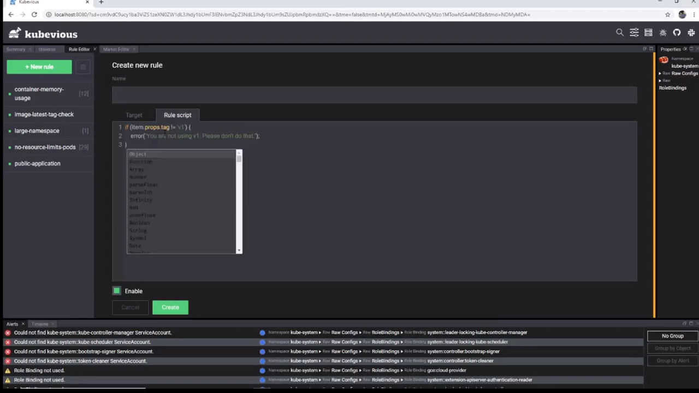

This way you can enforce you organization rules.

### Capacity Planning Simplified
When it comes to capacity planning in kubernetes two keys points are there - One is the resource utilization of your components and other is how much over priviledged your components are.
Kubevious simplifies both, you can quickly check resource configuration in properties window here.

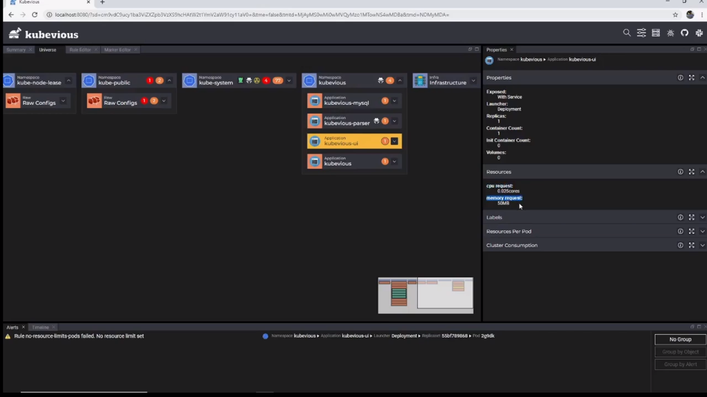

 And over priviledged resoures are marked with markers I explained in last section.


### RBAC linked views
Role based access control important and complex concept in kubernetes, I am going to comeup with a detailed video on RBAC in my channel [BribeByBytes](https://youtube.com/c/BribeByBytes?sub_confirmation=1), do hit that subscribe button, if you would like to watch one.
If you look at RBAC directly on yaml file it might become pretty complex to follow. 

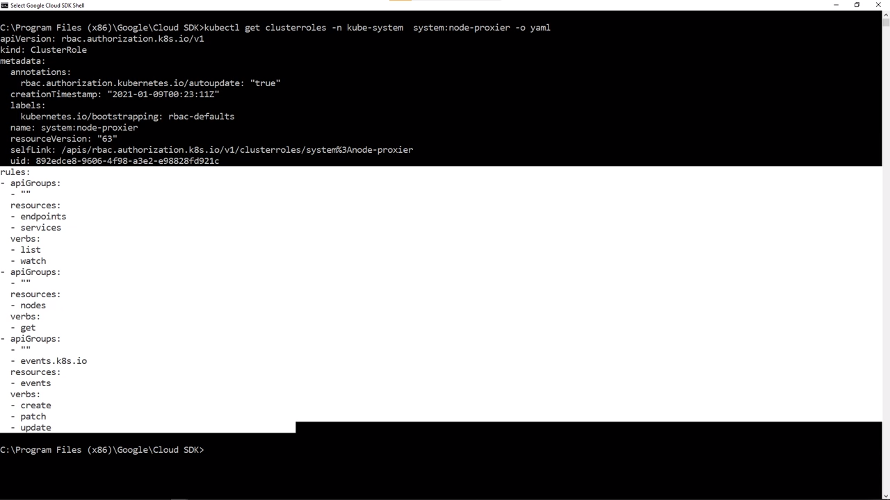

Kubevious simplifies it by showing easy to read matrix. If I again take you to argocd-application-controller and expand "resource role matrix" in properties window, you can see a neat representation, have you ever seen any other GUI does this. I havent, if you have add that to the comments would like to hear from you.

### Should you use it?
I just explained all the features the tool has to offer, now we come to the main question, who should really use it. Kubernetes even though a container orchestrator sounding like more infrastruture operations related tool, developers are also well aware of it, as they have to create the yaml manifests to instruct the cluster.
I see this being used by both developers and operations using it for its configuration validations, blast radius analysis for new changes, and full text crazy search it offers. I have not personally tested this in a huge cluster for performance, do let me know in comments, if you would like to see a perfornance benchmark of this tool on large clusters.

## Kubevious portable
I know when I started this article I mentioned install Kubevious into the cluster to unveal its full power. But if you just want to give it a try you can try using [kubevious portable version](https://github.com/kubevious/kubevious#running-kubevious-outside-the-cluster) that runs on your local machine but with limited functionality like for e.g., time machine is not there etc.

Now that we have come to end of this article, you can check my videos on other GUI/IDEs like [K9S](https://www.youtube.com/watch?v=1EaVrpMvLH0) and [Kubernetes Lens IDE](https://www.youtube.com/watch?v=namZg1UC7wc). And dont miss by full free playlist on [Kubernetes simplified](https://www.youtube.com/watch?v=1Xt-0_wsFnM&list=PL-dDmq4YllM9w7i2Mn8vGXisCul1OTltu) and hit that subscribe button.


