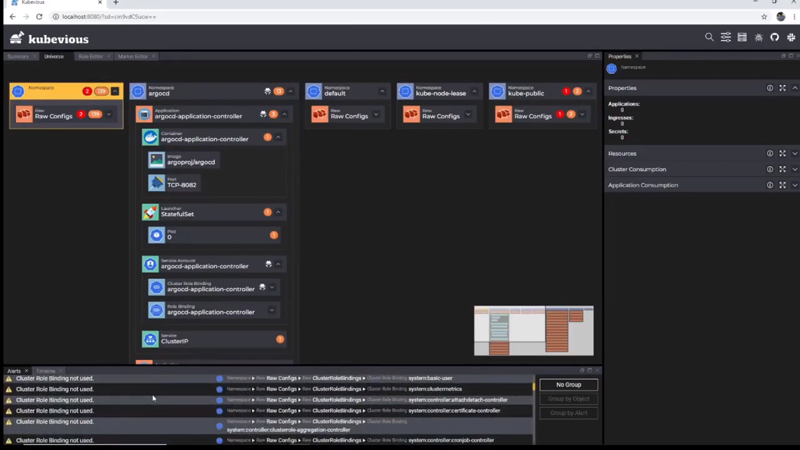

## Youtube Creators

TODO

## Blogs

This document section will explain how to publish your blog posted here to dev.to and medium.com.

### Step 1 - Register yourself
Register yourself in dev.to and medium.com. We encourage individual registrations to get industry visibility and contribution recognition.

### Step 2 - Get Authentication Credentials like api_key or oauth2
Its very easy, refer https://docs.dev.to/api/#section/Authentication

### Step 3 - Prepare your blog
If you have already published your blog in bribebytes.github.io/landing-page/blog then you are already 90% closer to publishing it to other sites

#### Some Pre-Requisites for easy imports
##### 1. Ensure all your images are pointing to public full URL and not relative URL.
    * Example:
            ``` markdown
            []
            instead of
            []   
            ```

##### 2. Ensure you have right headers (markdown front matter) metadata that is suggested by respective sites
    *  Our Blog (Docusaurus based)
            ```
            ---
            id: Kubevious
            title: Kubevious - Not so Obvious GUI for Kuberenetes
            author: Narayanan Krishnamurthy
            author_title: Technical Architect
            author_url: https://www.linkedin.com/in/narainkrishh/
            author_image_url: https://media-exp1.licdn.com/dms/image/C5603AQFA5uSldPgdfQ/profile-displayphoto-shrink_200_200/0/1587882605274?e=1618444800&v=beta&t=BQ8IkoK2xMuYHnerX41WwK73NSHgRXUMOg_dTlflRoU
            image: https://raw.githubusercontent.com/bribebybytes/landing-page/master/static/screenshots/kubevious/kubevious-cover.jpg
            tags: [kubernetes, devops, gui, dashboard, narainkrishh, bribebybytes]
            ---
            ```

    *  dev.to

            ```
            ---
            title: Kubevious - Not so Obvious GUI for Kuberenetes
            published: false
            tags: kubernetes, devops, gui, dashboard, narainkrishh, bribebybytes
            canonical_url: https://bribebybytes.github.io/landing-page/blog/Kubevious
            cover_image: https://raw.githubusercontent.com/bribebybytes/landing-page/master/static/screenshots/kubevious/kubevious-cover.jpg
            ---
            ```

### Step 4: Publishing

#### Publishing to our Blog (Docusaurus based) - https://bribebybytes.github.io/landing-page/blog/

1. Create your .md file.
2. Add file to /blog folder and Raise a PR to https://github.com/bribebybytes/landing-page
3. Once PR is approved, our CI/CD will deploy the site to https://bribebybytes.github.io/landing-page/blog/

        Command Reference

            ```
            yarn start #for local development and validations
            yarn run deploy to publish it to gh-pages, which is actually auto-hosted by github @ https://bribebybytes.github.io/landing-page
            ```

#### Publishing to dev.to - https://dev.to
Ensure you have right front matter as explained above

pushing using curl
        
            ```
            # Go inside landing-page folder
            # Below single line script will escape new line and quotes and make it ready for curl

            MARKDOWN_FILE='{"article":{"body_markdown":"' + $(sed 's/"/\\"/g' blog/2020-02-08-kubevious.md | awk '{printf "%s\\n", $0}') + "}}'

            API_KEY= #get it using https://docs.dev.to/api/#section/Authentication

            curl --traces "fullog" -X POST -H "Content-Type: application/json" -H "api-key: $API_KEY" --data "$(echo $MARKDOWN_FILE)" https://dev.to/api/articles
            ```
            
:::note
Please note article to dev.to will be pushed as draft, check your logo->dashboard in dev.to to see drafts. To publish it add to front matter "published: true" and save. This we can automate (TODO) once we are clear with this process manually.
:::

:::info
dev.to support  with just youtube video id to embed that video.
While medium support full URL https://www.youtube.com/watch?v=E3giPRiXSVI for embedding youtube videos.
Including both makes it easier to publish to both dev.to and medium same article

check landing-page/blog/2020-02-08-kubevious.md for example
:::

#### Publishing to medium.com https://medium.com
    Supports import articles, check https://help.medium.com/hc/en-us/articles/214550207-Importing-a-post-to-Medium
